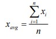

# Taller MVN-GIT

En este proyecto se realizo una calculadora la cual tenia como objetivo   calcular la media muestral y desviación estándar de un conjunto de datos.
Para resolver este laboratorio se utilizaron estas formulas:



 
## Empezando

Para ejecutar el programa debe descargar el .zip que se encuentra en el repositorio, luego se debe descomprimir y situarse en el directorio del archivo a través de línea de comando, por último se debe ejecutar el siguiente comando .jar
```
java -cp target/miprimera-app-1.0-SNAPSHOT.jar edu.escuelaing.arem.ASE.app.Calculadora
```

### Pre-requisitos

Solo necesita tener instalado Java en su computadora para que el comando funcione.

### Documentación

La documentación se encuentra en la carpeta doc.


## Probando

Existen 2 archivos datasize.txt, datahours.txt,Para modificar el objeto de análisis, se debe cambiar el archivo datasize.txt o en su defecto datahours.txt que se encuentran en la raíz del proyecto. Cambiando, agregando o eliminando datos para su análisis, siempre siguiendo con la notación presentada en el ejemplo.

## Autor

* **Javier Vargas** - *ECI*

## License

Este proyecto está licenciado bajo GNU  GENERAL PUBLIC LICENSE v3.0 - ver [LICENSE.txt](LICENSE) para más detalles.

